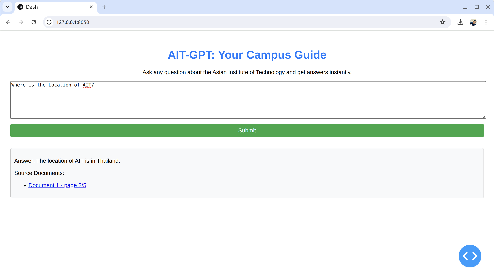

# AIT Chatbot Development Project

This repository contains the code and documentation for a chatbot designed to assist with inquiries related to the Asian Institute of Technology (AIT). The project is divided into several key tasks:

## Task 1:

### Components

1. **Prompt System**: Guides the model to generate relevant and coherent responses based on user queries.
2. **Retrieval**:
   - **Document Loaders**: Extract text from various formats, enriching the bot's knowledge base.
   - **Document Transformers**: Segment large documents into digestible chunks.
   - **Text Embedding Models**: Convert text into vector representations for semantic search.
   - **Vector Stores**: Manage storage and retrieval of text embeddings.
   - **Retrievers**: Use embeddings to identify and return relevant documents.

### Instructions

- Modify the existing notebook `01-rag-langchain.ipynb` to include:
  - Comprehensive sourcing of documents related to AIT from reputable databases.(AIT Brocure from AIT Website)
  - Design of a gentle and informative Prompt Template for AIT-GPT.

## Task 2: Analysis and Problem Solving

- **Evaluate the model’s performance in retrieving information.**

  - **Handling Clear Queries:**
  The bot’s ability to respond accurately to clear questions like "Who are you?" and specific queries about the location or courses offered by AIT suggests that the retrieval mechanisms and source documents are
  appropriately aligned for such inquiries.
  Ensuring that the documents are comprehensive and well-organized will help maintain or improve performance for these types of queries.

  - **Handling Ambiguous Queries:**
  For ambiguous or poorly formulated queries, the bot’s performance can be erratic. This is often due to the model's limitations in understanding nuanced human language or the absence of clear information in
  the source documents to match the query intent.
  Implementing a clarification mechanism where the bot asks follow-up questions to refine the user’s query could significantly enhance accuracy. This approach helps narrow down the user's intent and provides
  the model with a clearer direction for retrieving or generating the right information.

- **Address issues of unrelated information.**
  - **Model Training and Fine-Tuning:**
  Further refining the training data and continuously fine-tuning the model’s algorithms can improve its ability to interpret and respond to complex queries. This might involve training on a broader range of
  topics or incorporating more diverse language structures into the training dataset.
  Regular updates and adjustments based on user feedback and interaction logs can also help identify and address specific areas where the bot underperforms.
  
  - **Performance Metrics and Monitoring:** 
  Establishing clear metrics for measuring the bot's performance (e.g., accuracy, relevance, user satisfaction) is crucial. These metrics can guide systematic improvements and help benchmark the bot’s
  capabilities over time.
  Continuous monitoring through logs and user feedback can provide ongoing insights into how well the bot meets user expectations and areas where it may require adjustments.

## Task 3: Chatbot Development - Web Application

 

### Components

- **Chat Interface**: Allows users to interact with the bot through typed messages.
- **Documentation**: Explains the interface between the web application and the language model.

### Technical Stack

- **Dash**: For building the interactive web application.
- **LangChain**: To manage interactions and data retrieval.
- **HuggingFace**: For embedding models and pipelines.
